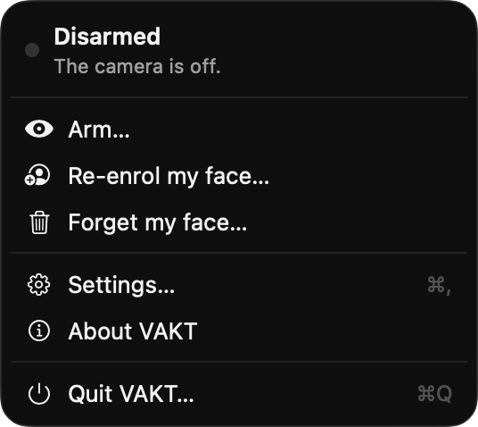
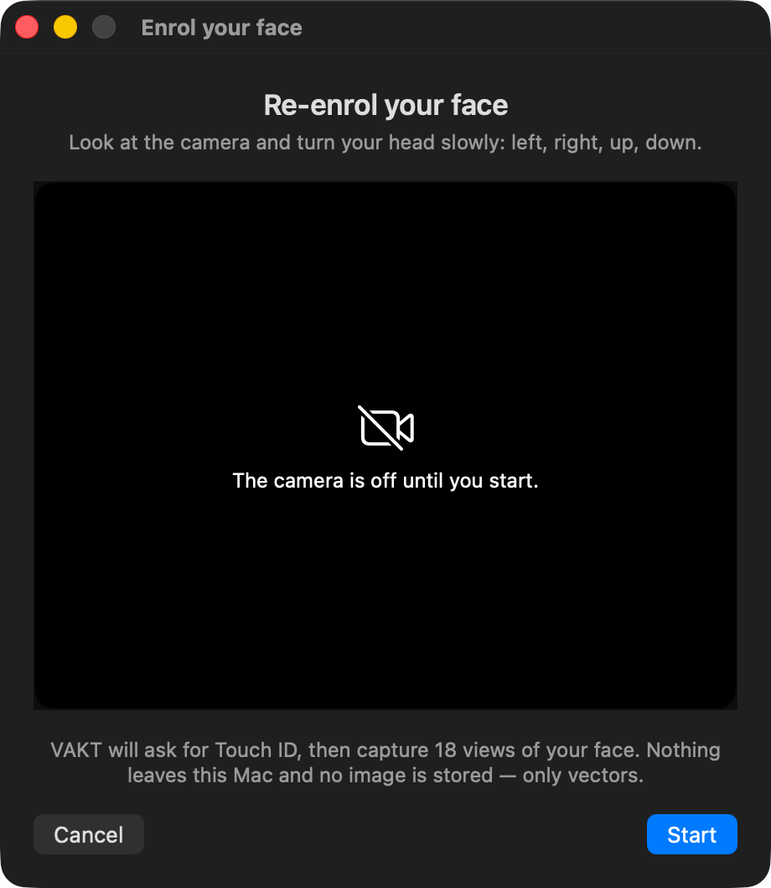
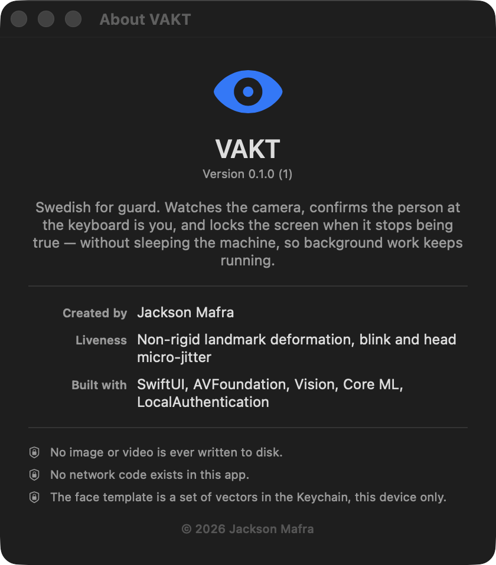

# VAKT

A menu-bar macOS app that watches the camera, confirms the person at the keyboard
is **you**, and locks the screen when it stops being true — without putting the
machine to sleep, so your agents keep running.

Arming, disarming, enrolling, changing rules and quitting all require Touch ID or
your login password.

*(Swedish "vakt" = guard / watch. Rename freely — the bundle id is in
`Resources/Info.plist`.)*

---

## Screens

| Menu bar | Enrolment | About |
|---|---|---|
|  |  |  |

The enrolment window shows the live camera, how many of the 18 views are in, and
why a frame was rejected — a capture that fails silently is indistinguishable
from a broken camera. While armed, the menu shows the liveness and match scores
that a lock decision would be made on.

---

## Why the motion requirement is the whole point

Face matching alone is trivially defeated: someone holds up your LinkedIn photo
and the session stays open. Macs have no TrueDepth or IR sensor — there is no
Face ID hardware to lean on — so liveness has to come from RGB video alone.

The core signal in `LivenessEngine` is **non-rigid deformation**:

> A photograph is a rigid plane. Every landmark on it moves under one single
> rotation + scale + translation. A real head is not rigid: the skull moves
> rigidly, but eyelids, brows and lips move *independently of it*.

So each frame pair does this:

1. Fit a similarity transform (closed-form Procrustes) using **only** the rigid
   landmarks — nose ridge, nose crest, median line, face contour.
2. Apply that transform to the **expressive** landmarks — eyes, brows, lips.
3. Measure how far off they land.
4. Subtract the residual of the rigid points themselves. That residual *is* the
   detector's noise floor, so the metric survives dim light and low frame rates
   without recalibration.

A printed photo or a phone screen gives step 3 ≈ step 4, so the energy is zero.
A live face gives a consistent gap.

Two supporting signals guard the corner cases:

| Signal | Weight | Catches |
|---|---|---|
| Non-rigid deformation | 0.55 | Held photo, phone/tablet replay |
| Blink (eye aperture collapse) | 0.35 | Very still faces, video loops without blinks |
| Head micro-jitter | 0.10 | A photo **taped to a stand** — perfectly zero motion is itself suspicious |

Blink detection is index-order independent: it derives each eye's long axis from
the two farthest-apart contour points, then measures the perpendicular spread.
No assumptions about Vision's point ordering.

Photo attack flow: identity says `owner`, liveness says `spoofSuspected`, the
controller waits out `spoofGrace` (8s by default, because a person reading
quietly genuinely barely moves), then locks with reason `spoofSuspected`.

Crucially, an `undecided` liveness verdict **does not** refresh your presence
timer. A photo cannot hold the session open just by existing.

---

## What locks the screen

| Reason | Trigger |
|---|---|
| `ownerAbsent` | No face for `absenceGrace` (25s) |
| `strangerPresent` | A non-matching face for `strangerGrace` (2s) |
| `spoofSuspected` | Matching face that never deforms, for `spoofGrace` (8s) |
| `cameraObstructed` | Mean luma below threshold for 6s while armed |
| `secondFace` | Second face in frame (off by default — noisy in open-plan) |

Locking uses `SACLockScreenImmediate` from `login.framework` (private API, fast,
clean), falling back to `CGSession -suspend`. Neither sleeps the machine.

`PowerAssertion` separately holds `PreventUserIdleSystemSleep` while armed. The
display is still free to sleep. Net effect: dark, locked screen; agents running.

---

## Layout

```
Sources/VAKT/
  VAKTApp.swift              MenuBarExtra entry point
  Core/
    Policy.swift             States, lock reasons, tunable policy + persistence
    SentryController.swift   State machine. Only thing allowed to call Locker.
  Capture/
    CaptureEngine.swift      AVFoundation, duty-cycled, mean-luma obstruction check
  Vision/
    FaceAnalyzer.swift       Vision wrapper, landmark grouping, Procrustes fit
    LivenessEngine.swift     The anti-photo logic
    IdentityEngine.swift     Face crop + embedding + cosine matching
  Security/
    AuthGate.swift           LocalAuthentication (.deviceOwnerAuthentication)
    EnrollmentStore.swift    Keychain-backed owner template
  System/
    Locker.swift             Screen lock, two paths
    PowerAssertion.swift     Keep the machine awake
    EventLog.swift           Append-only JSONL decision log (no images)
  UI/
    MenuContent.swift        Menu bar popover
    SettingsView.swift       Policy editor, auth-gated on save
Resources/
    Info.plist, VAKT.entitlements, com.jacksonmafra.vakt.plist (LaunchAgent)
```

---

## Build

The Xcode project is generated from `project.yml`, so it is not checked in.

```sh
brew install xcodegen                 # once
xcodegen generate                     # writes VAKT.xcodeproj
open VAKT.xcodeproj                   # or build from the command line:
xcodebuild -project VAKT.xcodeproj -scheme VAKT -configuration Debug -derivedDataPath build build
open build/Build/Products/Debug/VAKT.app
```

Grant camera access on the first arm. Edit `project.yml` and regenerate rather
than changing project settings in Xcode — the project file is disposable.

`project.yml` already pins the two settings that matter: **Hardened Runtime on,
App Sandbox off**. The sandbox blocks both lock paths — VAKT would detect an
intruder and then be unable to act on it.

Signing is empty by default, which means ad-hoc ("Sign to Run Locally"). That
runs, but macOS then disables Hardened Runtime and re-prompts for camera and
Keychain access on every rebuild, because the code identity changes each time.
Put your team in `Local.xcconfig` to stop that:

```
DEVELOPMENT_TEAM = ABCDE12345
```

For it to survive a force-quit, copy `VAKT.app` to `/Applications` and load the
LaunchAgent:

```sh
cp com.jacksonmafra.vakt.plist ~/Library/LaunchAgents/
launchctl bootstrap gui/$(id -u) ~/Library/LaunchAgents/com.jacksonmafra.vakt.plist
```

Also set the OS to require the password immediately after the screen locks —
otherwise VAKT locks and the intruder wakes it straight back up:

```sh
sysadminctl -screenLock immediate -password -
```

---

## The one decision left to you: which embedder

`IdentityEngine` takes a `FaceEmbedder`. Two implementations ship:

**`FeaturePrintEmbedder`** — zero dependencies, uses Vision's built-in
`VNGenerateImageFeaturePrintRequest` on the aligned crop. It is a *general image
similarity* descriptor, not an identity descriptor. It will separate you from a
random colleague under stable lighting; it will not reliably separate you from a
sibling, and it drifts when the lighting changes. Fine for getting it running
tonight.

**`CoreMLFaceEmbedder`** — the real answer. Convert FaceNet / ArcFace /
MobileFaceNet to Core ML, drop `FaceEmbedder.mlmodel` in the bundle, and it is
picked up automatically (`SentryController.init` tries Core ML first, falls back
to featureprint). Expects one image input and a 1-D float output; vectors are
L2-normalised, so matching is a dot product.

The template stores its `embedderIdentifier` and refuses to compare against a
template produced by a different model — swap models and you are prompted to
re-enrol rather than silently getting garbage similarities.

---

## Calibration

Everything is a threshold, and thresholds are personal. Arm it, watch the
liveness and match numbers in the menu, then edit:

| Where | Knob | Start | Symptom if wrong |
|---|---|---|---|
| `LivenessEngine.Tuning.fullMotion` | 0.020 | fraction of interocular distance | too low → a photo scores live; too high → you get flagged for sitting still |
| `LivenessEngine.Tuning.spoofAt` | 0.25 | spoof verdict floor | raise if photos survive |
| `IdentityEngine.acceptThreshold` | 0.62 | cosine | FaceNet-ish. Featureprint usually needs higher |
| `IdentityEngine.rejectThreshold` | 0.45 | cosine | lower = fewer stranger false alarms |
| `IdentityEngine.minCaptureQuality` | 0.35 | Vision quality | raise if blurry frames cause false locks |
| `Policy.spoofGrace` | 8s | | raise if you read very still and get locked out |

`~/Library/Application Support/VAKT/events.jsonl` records every decision with the
scores that produced it. Decisions only — no frames, ever. That file is how you
tune it without guessing.

---

## Privacy and honest limits

**Privacy.** No frames are written to disk. No network code exists in the app.
The enrolled template is a set of float vectors in the Keychain, marked
`WhenUnlockedThisDeviceOnly` and non-syncing; it cannot be turned back into a
photograph of your face.

One deliberate design choice worth knowing: the template is stored *without* a
biometric access-control flag. If reading it required user presence, the
background watcher would prompt for Touch ID on every frame. Protection lives on
the write and delete paths, which go through `AuthGate`.

**Macs without Touch ID.** Nothing special is needed: `AuthGate` asks for
`.deviceOwnerAuthentication`, which is Touch ID where it exists and the login
password (or an unlocked Apple Watch) where it does not. Settings shows which
one this Mac will use.

A Mac with **no login password at all** is the case worth knowing about, because
authentication is then impossible and every gated control would otherwise become
a silent no-op. VAKT splits the two directions:

- Anything that *weakens* protection is refused, with the reason shown in the
  menu: arming, enrolling, changing the rules. A guard whose own off switch is
  unguarded is worse than no guard.
- Anything that *unwinds* still works: disarm, forget my face, quit. Otherwise an
  armed VAKT could be neither stopped nor quit from its own menu, while the
  LaunchAgent relaunched it on every force-quit.

**Limits — read these before trusting it.**

- Passive RGB liveness is probabilistic, not a Face ID equivalent. A
  high-quality video of you played on a bright screen, held steady at the right
  distance, will produce real non-rigid motion and real blinks. This design
  defeats *photos*, which is the attack you described. It does not defeat a
  determined video replay. Screen-replay defence needs moiré/frequency analysis —
  see roadmap.
- The camera LED is wired to the sensor in hardware and will light up whenever
  VAKT samples. Nothing can suppress that. Treat the blinking LED as an honest
  "armed" indicator.
- Continuous camera use costs battery. That is what the duty cycle is for: short
  bursts while nothing is in frame, continuous only once a face appears.
- An attacker with your *already unlocked* Mac has many options besides the
  camera. VAKT plus the LaunchAgent raises the cost; it is not containment. Keep
  the OS idle screen-lock timer short as a second layer.
- `SACLockScreenImmediate` is private API. Fine for a personal build, will not
  pass App Store review, could break in a future macOS.

---

## Roadmap

1. **Screen-replay detection.** FFT over the face crop: displays leave moiré
   banding and prints have an unnaturally flat high-frequency response. Slots in
   as a fourth weighted signal in `LivenessEngine`.
2. **Background rigidity.** Optical flow on the region *around* the face — a
   held photo has a hard rectangular edge that moves with it. Very strong signal
   for the print attack specifically.
3. **Apple Watch proximity as a second factor.** Unlocked Watch nearby raises the
   presence bar; absent Watch shortens every grace period.
4. **Intruder snapshot.** Optional single frame on `strangerPresent`, written to
   a 0700 directory, auto-purged after N days. Off by default.
5. **Adaptive template.** Slowly fold in high-confidence live matches so glasses,
   a beard change or a new office light do not degrade the match over months.
